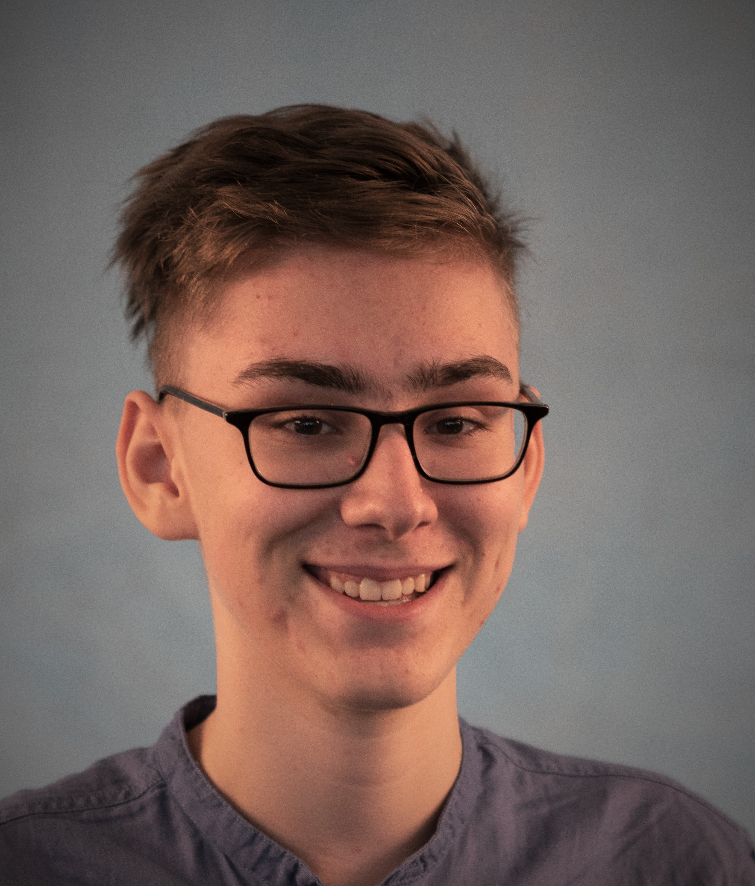

# Marc Blatter

### Über mich:
Ich habe mich schon früh für die IT bzw. wie ein PC funktioniert interessiert. Zuerst habe ich die Grundlagen des heutigen/älteren PC's/IT-Infrastruktur nachgeschaut/gefragt, danach habe ich das Programmieren entdeckt. Ich lernte wie die jeweiligen Sprachen mit der Hardware interagieren. Anschliessend wollte ich meinen eigenen PC bauen, also habe ich das auf dem Internet gelernt und somit vieles anderes gefunden/gelernt.

### Ausbildung:
    - Primarschule Gossau
    - Gymnasium Fiedberg
    - Pegasusschule (Waid \ Gymnasialvorbereitungsjahr)
    - 10 Schuljahr (GBSSG)

### Tolle Sprachen:
    - HTML
    - CSS
    - JS (wenig)
    - C#
    - Java
    - JSON (wenig)

### Sprachen:
    - Schweizerdeutsch
    - Deutsch
    - Englisch
    - Latein (wenig)

### Böse Sprachen:
    - Französisch

</Marc Blatter>