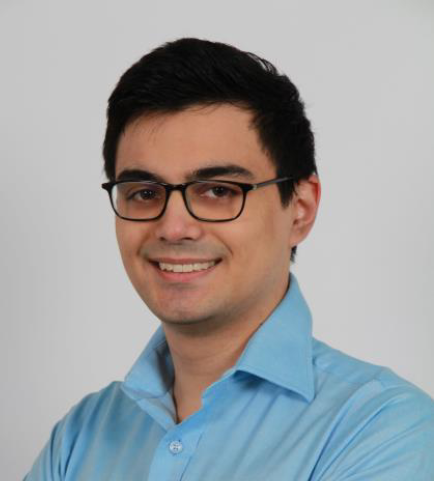

# Adrian Orlamünde

## Kurze Biographie

Schon sehr früh habe ich mich für Computer und die Technik dahinter interessiert, sodass für mich schnell klar war: Ich möchte Informatiker werden! Nicht nur im Beruf, sondern auch in meiner Freizeit beschäftige ich mich intensiv mit den verschiedensten Computer Programmen und schreibe sogar selbst welche.

### Ausbildung

- 2008 - 2014: Primarschule Oberbüren
- 2014 - 2018: Sekundarschule Oberbüren
- 2018 - 2021: IMS mit Schwerpunkt Wirtschaft (IMS-W)

## Sprachen die ich spreche

- Deutsch Muttersprache
- Englisch seit der 3. Klasse
- Französisch seit der 4. Klasse

## Programmiersprachen

- Java
- PHP
- HTML
- C#
- SQL

