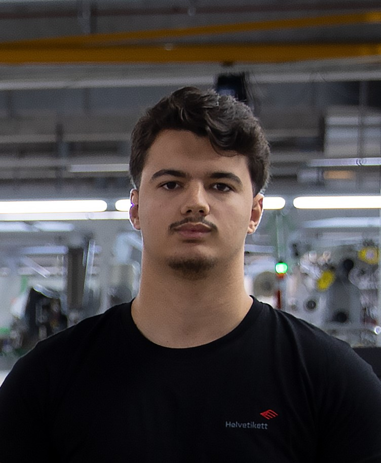

# Leotrim Ramadani



## Kurze Biographie

Auch in der Oberstufe wusste ich nicht was ich werden wollte, so habe ich die Aufnahmeprüfung für die Informatik Mittelschule geschrieben und habe sie dann auch gerade so bestanden. Nach drei Jarhren musste ich diese Schule dann aber verlassen, worauf ich mir sofort eine Lehre gesucht und dann auch gefunden habe.

### Meine Ausbildungsschritte

- 2019: Abschluss Sekundarschule Flums
- 2019 - 2022: Informatik Mittelschule besucht
- 2022: Lehre bei der Helvetikett AG in Grabs

## Sprachen die ich spreche

- Albanisch
- Deutsch
- Englisch
- Französisch (schlecht)

## Hallo Welt in meiner Lieblingssprache

Meine Lieblingssprache ist `C#`, da die meine erste Programmiersprache ist:

```c#

Console.Writeline("Hello World!");

```
